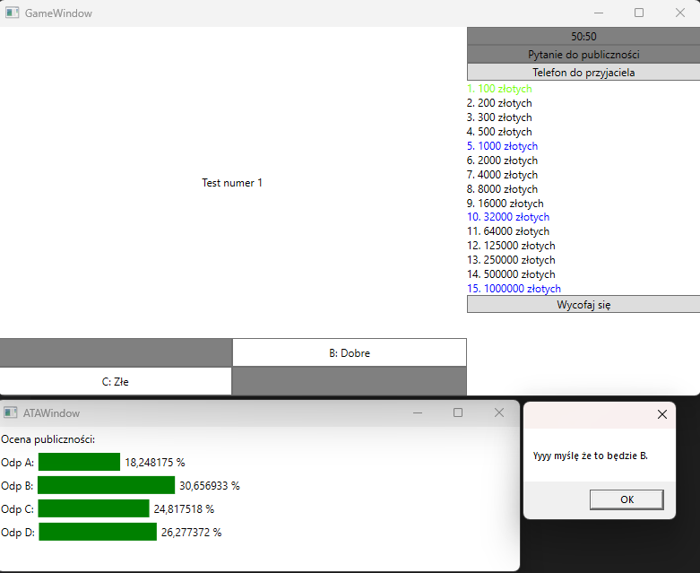
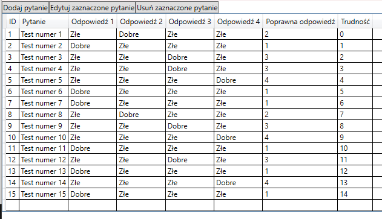

# Simple "Who wants to be a millionaire" type game

Quiz game implementation in C# using WPF for the GUI and Entity Framework Core for accessing the local SQLite question database.

Working lifelines and built in question editor.

Made for practice of the above technologies.

## Gamemodes

The game has 3 gamemodes:
- `Classic` (15 questions, 2 checkpoints)
- `Standard` (12 questions, 2 checkpoints)
- `4 lifelines` (12 questions, 1 checkpoint, extra `Change Question` lifeline)

## Lifelines

The game has 3 or 4 (depending on the gamemode) lifelines you can use once during the game:
- `50:50` - removes two wrong answers
- `Ask The Audience` - shows a chart of audience guesses (sometimes can give the wrong answer)
- `Phone A Friend` - shows a friend's opinion on which answer is correct (25% chance to be wrong)
- `Change Question` (only in the `4 lifelines` gamemode) - changes the question to another one from the database with equal or lower difficulty rating (if no such question exists, simply shows a warning message and doesn't remove the lifeline)

## Database

The database is a SQLite database with a single table called `Questions`. The table has 8 columns:
- `QuestionId` - the question's ID (primary key, autoincrement)
- `QuestionText` - the question text
- `Answer1` - Answer A's text
- `Answer2` - Answer B's text
- `Answer3` - Answer C's text
- `Answer4` - Answer D's text
- `CorrectAnswerId` - the correct answer (1-4)
- `Difficulty` - the difficulty rating of the question (0-14, corresponds to the question number in game, the gamemodes with 12 questions start at difficulty 3)

You can add/edit/delete questions in the game's built in editor.

## Screenshots

    
Main Menu

    
Gamemode Select

    
Game Window

    
Lifelines

    
Editor

    
Add/Edit Window

#
# Prosta gra typu "Milionerzy"

Implementacja gry w C# z użyciem WPF do GUI i Entity Framework Core do obsługi lokalnej bazy danych SQLite.

Działające koła ratunkowe i wbudowany edytor pytań.

Zrobione dla ćwiczenia powyższych technologii.

## Tryby gry

Gra ma 3 tryby:
- `Klasyczny` (15 pytań, 2 kwoty gwarantowane)
- `Standardowy` (12 pytań, 2 kwoty gwarantowane)
- `4 koła ratunkowe` (12 pytań, 1 kwota gwarantowana, dodatkowe koło ratunkowe `Zmiana pytania`)

## Koła ratunkowe

Gra ma 3 lub 4 (w zależności od trybu) koła ratunkowe, które możesz użyć raz podczas gry:
- `50:50` - usuwa dwie nieprawidłowe odpowiedzi
- `Pytanie do publiczności` - pokazuje wykres odpowiedzi zgadywanych przez publiczność (losowo generowany, czasami może pokazać nieprawidłową odpowiedź)
- `Telefon do przyjaciela` - pokazuje zdanie przyjaciela na temat poprawnej odpowiedzi (25% szansy na błędną odpowiedź)
- `Zmiana pytania` (tylko w trybie `4 koła ratunkowe`) - zmienia pytanie na inne z bazy danych o tej samej lub niższej wartości trudności (jeśli nie ma takiego pytania, po prostu pokazuje ostrzeżenie i nie usuwa koła ratunkowego)

## Baza danych

Baza danych to baza danych SQLite z pojedynczą tabelą o nazwie `Questions`. Tabela ma 8 kolumn:
- `QuestionId` - ID pytania (klucz główny, autoinkrementacja)
- `QuestionText` - tekst pytania
- `Answer1` - tekst odpowiedzi A
- `Answer2` - tekst odpowiedzi B
- `Answer3` - tekst odpowiedzi C
- `Answer4` - tekst odpowiedzi D
- `CorrectAnswerId` - poprawna odpowiedź (1-4)
- `Difficulty` - wartość trudności pytania (0-14, odpowiada numerowi pytania w grze, tryby z 12 pytaniami zaczynają się od trudności 3)

Możesz dodawać/edytować/usuwać pytania wbudowanym w grę edytorem.

## Zrzuty ekranu

    
Menu główne

    
Wybór trybu gry

    
Okno gry

    
Koła ratunkowe

    
Edytor

    
Okno dodawania/edycji

